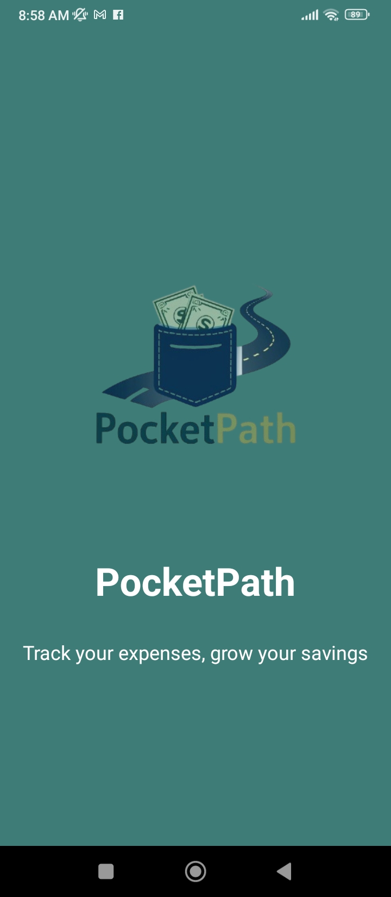
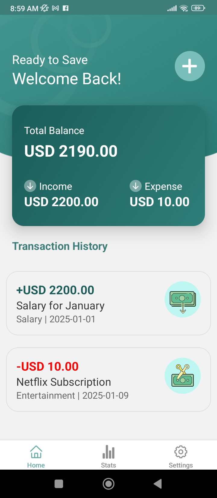
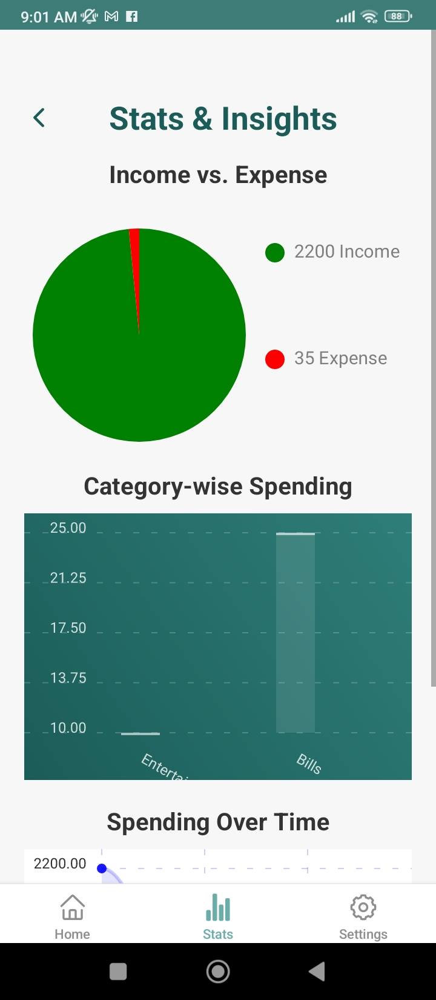
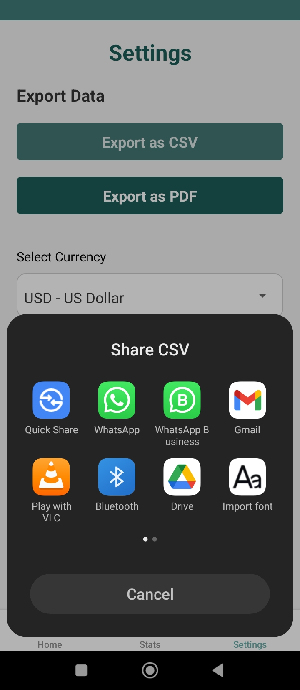
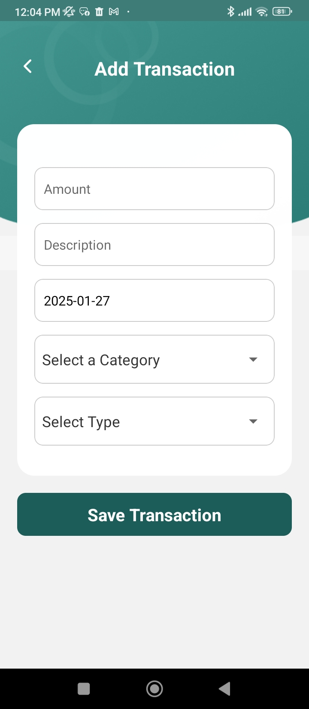
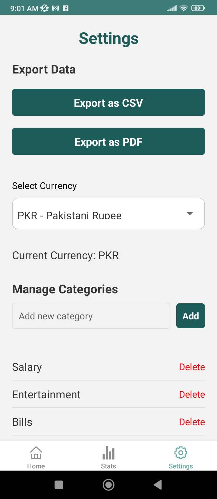

# React-Native-Projects
A collection of mobile apps built with React Native, showcasing features, designs, and functionality. Includes banners, screenshots, and downloadable APKs for testing. Explore my work in UI/UX design, API integration, and state management. Feedback is welcome! 😊

---

## 🌟 Featured Projects

### PocketPath - Expense Tracker App 📊💰

#### Description:
PocketPath is a React Native application designed to help users efficiently track their expenses, manage budgets, and save money. With a clean and user-friendly interface, PocketPath empowers users to log their transactions, analyze spending patterns, and make informed financial decisions.

## Features

- 💵 **Add Transactions:** Quickly log income and expenses with categories and descriptions.
- 📊 **Visual Insights:** View expenses through interactive pie charts, bar graphs, and line charts.
- 🌎 **Multi-Currency Support:** Change the currency of your transactions based on your preference.
- 🛠️ **Manage Categories:** Add, edit, or delete spending categories to suit your needs.
- 📄 **Export Data:** Export transaction history as CSV or PDF for external use.
- 🚀 **Fast and Lightweight:** Built with React Native and optimized for performance.

|  |  | |
|:-----------------------------------------------------------------:|:-----------------------------------------------------------------:|:-----------------------------------------------------------------:|
|  |  | |

#### Download:
[Download APK](./APKs/pocketpath.apk)

---
